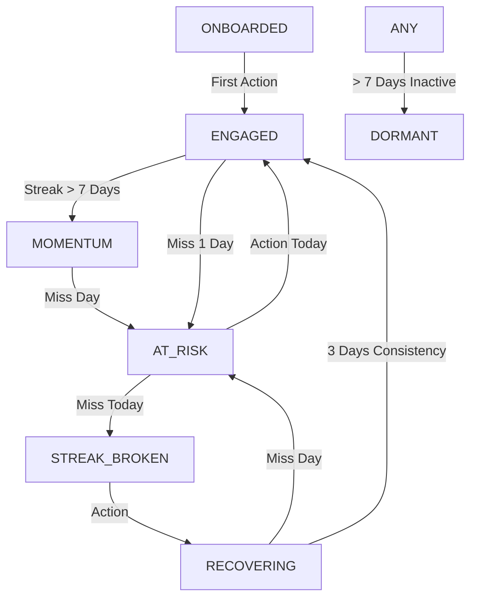

# Retention State Machine

This document defines the **Psychological States** of a user within the IRON system.
The engine transitions users between these states deterministically based on Time and Events.

**Status**: [LOCKED]
**Authority**: `src/core/behavior/DailyEngine.js`

---

## The States (`engagement_state`)

### 1. `ONBOARDED` (The Clean Slate)
- **Definition**: User has joined but hasn't completed their first session.
- **Entry**: Initial Account Creation.
- **Exit**:
  - First Action -> `ENGAGED`

### 2. `ENGAGED` (The Flow State)
- **Definition**: The user is consistent. Streak is Active (1-6 days).
- **Entry**: 
  - `ONBOARDED` -> First Action.
  - Completing Recovery.
- **Exit**:
  - Streak grows >= 7 -> `MOMENTUM`
  - Miss 1 Day -> `AT_RISK`

### 3. `MOMENTUM` (The Super State)
- **Definition**: Streak > 7 Days. The user is "In the Zone".
- **Privileges**: Higher Score Multipliers, Status Shields.
- **Exit**:
  - Miss 1 Day -> `AT_RISK` (Fall from grace is strict).

### 4. `AT_RISK` (The Grace Period)
- **Definition**: The user missed *Yesterday*. The habit is threatened.
- **UI Implication**: "Crisis Banner" (Yellow/Red). Urgent Call to Action.
- **Mechanics**:
  - **Grace Window**: 24 Hours.
  - **Save Condition**: Complete `CHECK_IN` or `REST` Today.
  - **Social Save**: Receive `SEND_SUPPORT` (Grants Freeze Token).
- **Exit**:
  - Action Today -> `ENGAGED` (or `MOMENTUM` if streak protected?) - *Currently resets to ENGAGED logic check*
  - Miss Today -> `STREAK_BROKEN`

### 5. `STREAK_BROKEN` (The Failure)
- **Definition**: The user missed 2+ consecutive days (or 1 day with no grace).
- **Mechanics**:
  - Streak Count reset to 0.
  - Freeze Tokens lost (if policy dictates).
- **Exit**:
  - Action Today -> `RECOVERING`

### 6. `RECOVERING` (The Climb)
- **Definition**: User successfully returned after a break, but trust is not yet established.
- **UI Implication**: "Recovery Mode" (Blue). Progress Bar (Days 1/3).
- **Mechanics**:
  - Streak counts up from 1.
  - **Requirement**: Must complete 3 consecutive days to exit.
- **Exit**:
  - 3 Consecutive Actions -> `ENGAGED`
  - Miss Day -> `AT_RISK` (or straight to `STREAK_BROKEN`)

### 7. `DORMANT` (The Void)
- **Definition**: No activity for > 7 days.
- **Mechanics**:
  - Tier drops to `DORMANT`.
  - Engagement Score decays significantly.

---

## State Transition Graph

