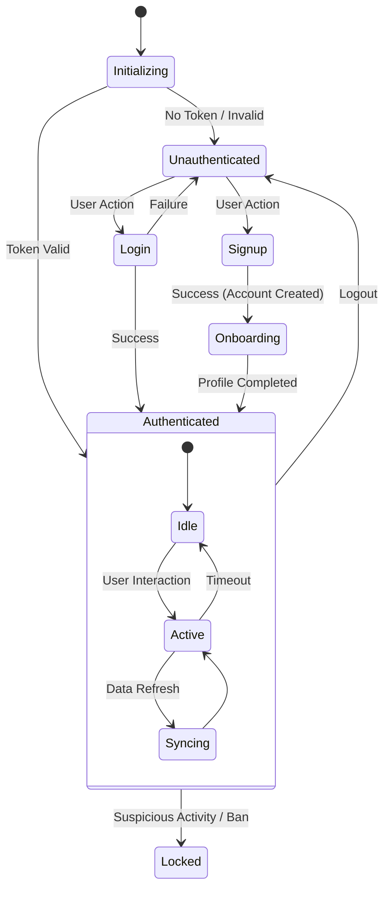

# Auth State Machine & Identity Binding

## State Diagram

## Identity Data Binding
The integrity of the system relies on the `uid` being the immutable anchor.

| Layer | Binding Key | Source of Truth |
| :--- | :--- | :--- |
| **Auth** | `auth.currentUser.uid` | Firebase Auth |
| **Profile** | `users/{uid}` | Firestore |
| **Streak** | `users/{uid}/checkins/` | Firestore |
| **Storage** | `uploads/{uid}_*` | Firebase Storage |

## Failure Modes & Recovery
1.  **Orphaned Auth**: User exists in Auth but `users/{uid}` doc is missing.
    -   *Behavior*: App should detect "Profile Missing" and redirect to Onboarding/Profile Creation, NOT crash.
    -   *Fix*: `AuthContext` now handles "New user from Provider" auto-creation in `syncUserFromAuth`.
2.  **Session Stale**: Token expired.
    -   *Behavior*: Firebase SDK auto-refreshes. If refresh fails, redirect to Login.
3.  **Role Mismatch**: Claim says 'user' but DB says 'super_admin'.
    -   *Resolution*: DB role takes precedence for app logic; Custom Claims should be updated via Cloud Function (not yet implemented).
